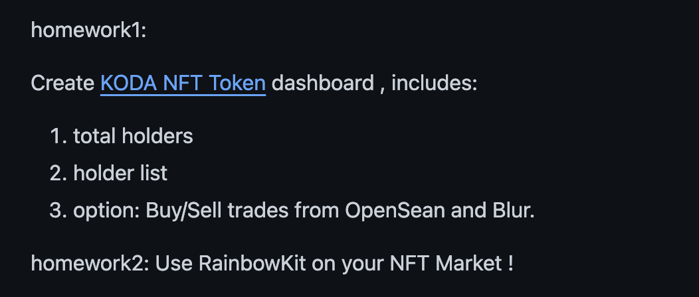
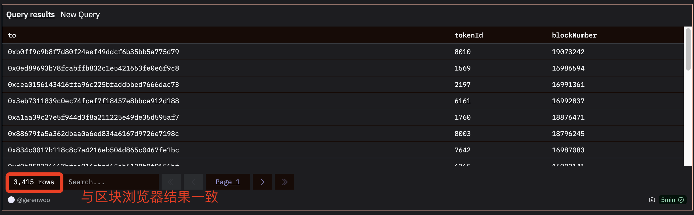
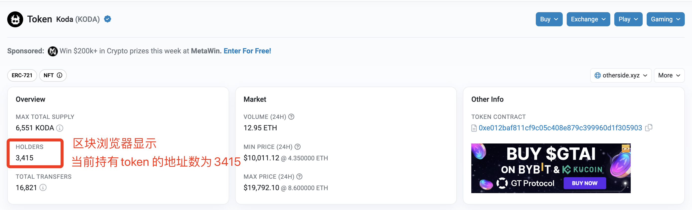

# 练习题（01.30）



## Dune Dashboard

**Dashboard URL**: https://dune.com/garenwoo/kodatest

**Token URL**：https://etherscan.io/token/0xe012baf811cf9c05c408e879c399960d1f305903


如以下两图所示，使用 **Dune** 建立 query 查询获得的 holder 数量与 **Etherscan** 中显示的 holder 数量一致。

### Dune 查询结果：Holder List



### Etherscan 显示的 token 信息




### 查询代码：

```mysql
WITH LatestTokenId AS (
  SELECT
    tokenId,
    "to",
    "evt_block_number" AS blockNumber,
    ROW_NUMBER() OVER (PARTITION BY tokenId ORDER BY "evt_block_number" DESC) AS rn
  FROM
    koda_lotm_v1_ethereum.Koda_evt_Transfer
  WHERE
    contract_address = 0xe012baf811cf9c05c408e879c399960d1f305903
), MaxTokenIdPerTo AS (
  SELECT
    "to",
    MAX(tokenId) AS MaxTokenId
  FROM
    LatestTokenId
  WHERE
    rn = 1
  GROUP BY
    "to"
)
SELECT
  a."to",
  a.tokenId,
  a.blockNumber
FROM
  LatestTokenId AS a
  INNER JOIN MaxTokenIdPerTo AS b ON a."to" = b."to" AND a.tokenId = b.MaxTokenId
WHERE
  a.rn = 1;
```


